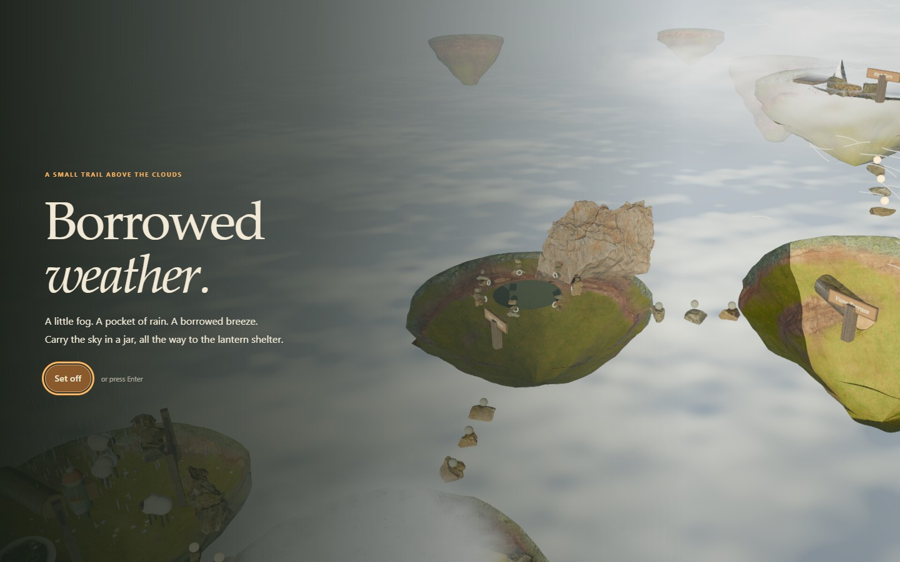
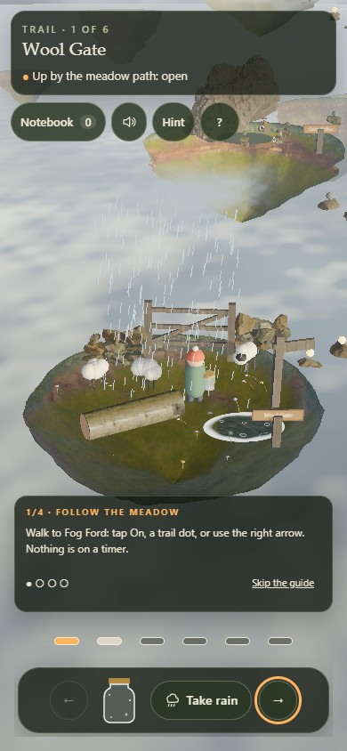
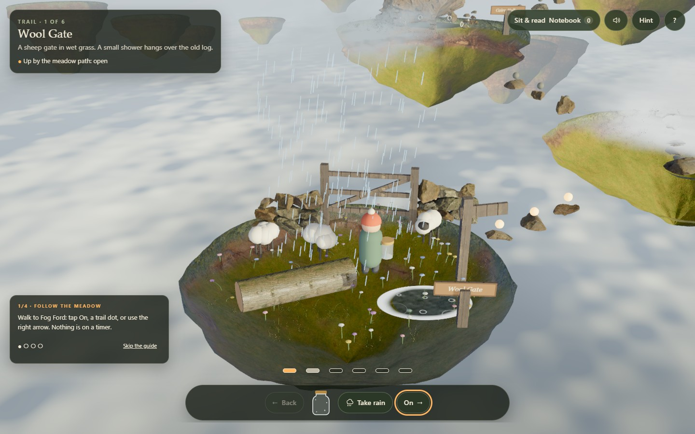

# BORROWED WEATHER

<p align="center"></p>

One hiker, one glass jar and a mountain that rearranges itself when you borrow its weather. Take fog, rain or wind from one place and release it in another to build a route to the Lantern Shelter. Every useful shortcut changes somewhere else.

**[Set off up the trail →](https://05-borrowed-weather.williamking.workers.dev)** · [Run locally](#run-locally) · [Credits](#credits)

<p align="center"></p>

## Learn the weather by using it

**Set off** begins a camera descent along the six connected dioramas. The optional four-step guide follows walking, taking, carrying and releasing, advancing only after your action. Later help responds to the place and weather you actually have.

| Weather | A few consequences |
| --- | --- |
| Fog | Veils stepping stones and a ferry lane; gathers into a cloud step in the marked hollow. |
| Rain | Uncurls ferns into steps, raises water and fills the shelter's gauge. |
| Wind | Drives a basket lift, fills a leaf ferry's sail and turns the shelter's instrument. |

The jar holds one kind at a time. To finish, reach the shelter and wake its three instruments. There is no countdown or permanent failure: you can undo a borrow by returning the weather, and a solver-backed hint helps recover the route.

| Action | Keyboard | Pointer or touch |
| --- | --- | --- |
| Walk | Left/Right or A/D | Diorama, trail dot or arrow buttons |
| Take fog / rain / wind | 1 / 2 / 3 | Take buttons |
| Release the jar | R | Release |
| Ask for a hint | H | Hint |
| Read discoveries | N | Notebook |
| Close a panel / toggle sound | Escape / M | Panel close / Sound |

## A trail that remembers what happened

The notebook records discoveries when their conditions actually occur. At the shelter, a postcard maps the route you took; replay clears the previous trip's clock and discoveries. Layered fog reveals and hides crossings, rain makes rings in the water, and the sound mix changes with your position and the weather around you.

The scene combines authored island forms with credited CC0 rock, turf, wood and foliage. Its sky also supplies the environment lighting. Quality tiers, prepared scene shaders and reduced rendering cost keep a tour through the trail from compiling a new scene during play.

## Rules and verification

Pure TypeScript rules and a breadth-first solver cover **37,430 reachable states**. The search both checks that the trail remains recoverable and supplies the in-game hint. Rendering and audio observe this state rather than deciding puzzle outcomes.

Application revision `9e020a1` passed **68 tests / 17,740 assertions** and seven RTX 2060 scenarios, including two complete trails, replay, discoveries, delayed startup, live reduced motion and three touch sizes. Read the [bug-pass report](docs/visual/BUG-PASS-2026-09-30.md).

Source map: [src/game/](src/game/) for rules and solver, [src/scene/](src/scene/) for the trail, [src/ui/](src/ui/) for notebook and controls, and [src/audio/](src/audio/) for the positional mix.

## Current screenshots

| Desktop | Phone |
| --- | --- |
|  |  |



The opening loop and three main screenshots were captured from the live site on **1 October 2026**, using Chrome on this workstation; the phone image is a 390 × 844 browser viewport. The animated preview is a short loop, not a full playthrough. [Capture details](docs/readme/capture.json).

## Run locally

Use **Bun 1.3.10** (the version pinned in `package.json`) and Node.js 22.12 or newer. From this repository:

```sh
bun install --frozen-lockfile
bun run dev      # http://127.0.0.1:4515/
bun run check    # strict types, Biome, unit tests and production build
bun run preview  # http://127.0.0.1:4615/ after the build
```

Development and preview are separate long-running commands; run one at a time or use separate terminals. `bun run build` writes the static production output to `dist/`. Dependencies and the lockfile are local to this project.

### Browser suite

Install the test browser once, then run the checked-in Playwright suite. Its configuration builds and starts the production preview. Browser scenarios are separate from `bun run check`.

```sh
bunx playwright install chromium
bun run e2e
```

The recorded real-GPU release checks used installed Chrome on an RTX 2060; the default Chromium configuration is not a claim of physical-phone coverage.

## Stack and release

Direct Three.js 0.186 · React 19.3 · strict TypeScript · Vite 8.3 · GSAP 3.15 · Tailwind CSS 4.3 · Bun 1.3.10 · Biome. The public website is served by Cloudflare Workers. This README describes [application revision 9e020a1](https://github.com/WilliamHenryKing/05-borrowed-weather/commit/9e020a15f3a61f33a8a661c5314284f000baa811); the documentation refresh changes no application behaviour.

## Credits

Every shipped third-party file is recorded, with its source URL, author, licence, retrieval date, checksums and processing steps, in [`assets.manifest.json`](assets.manifest.json).

Visuals are all CC0 from [Poly Haven](https://polyhaven.com), resized and re-encoded as WebP (textures) or through gltf-transform with meshopt (models):

| Asset | Source | Author | Licence | Used for |
| --- | --- | --- | --- | --- |
| Table Mountain 1 (Pure Sky) HDRI | [Source](https://polyhaven.com/a/table_mountain_1_puresky) | Greg Zaal, Jarod Guest | CC0 | Sky, image-based light, sun |
| Cliff Side | [Source](https://polyhaven.com/a/cliff_side) | Poly Haven | CC0 | Island rock |
| Mossy Rock | [Source](https://polyhaven.com/a/mossy_rock) | Poly Haven | CC0 | Moss, shelter masonry |
| Grass Ground | [Source](https://polyhaven.com/a/grass_ground) | Poly Haven | CC0 | Turf, shelter roof |
| River Small Rocks | [Source](https://polyhaven.com/a/river_small_rocks) | Poly Haven | CC0 | Beck and tarn beds |
| Weathered Planks | [Source](https://polyhaven.com/a/weathered_planks) | Poly Haven | CC0 | Gate, posts, jetty, signs |
| Bark Brown 02 | [Source](https://polyhaven.com/a/bark_brown_02) | Poly Haven | CC0 | Logs, lift basket |
| Rock Moss Set 01 and 02 | [Source](https://polyhaven.com/a/rock_moss_set_01,) [Source](https://polyhaven.com/a/rock_moss_set_02) | Poly Haven | CC0 | Walls, cairns, banks, stepping stones |
| Boulder 01 | [Source](https://polyhaven.com/a/boulder_01) | Poly Haven | CC0 | Hollow ledge, terrace cliff |
| Grass Medium 02, Fern 02 | [Source](https://polyhaven.com/a/grass_medium_02,) [Source](https://polyhaven.com/a/fern_02) | Poly Haven (processed for ODD TIDE) | CC0 | Grass and ferns |

The islands, fog, water, clouds, jar, hiker, sheep, instruments and icons are generated in code. The post-processing chain, foliage wind and terrain shading are adapted from the ODD TIDE project in the same portfolio collection.

Audio is all CC0 (public domain). It was converted to mono OGG Vorbis, trimmed and crossfaded into loops, about 1.3 MB in total, in `public/audio/`:

| File(s) | Source | Author | Licence |
| --- | --- | --- | --- |
| `music.ogg` ("Contemplation") | [Source](https://opengameart.org/content/contemplation-0) | Joth | CC0 |
| `amb-rain.ogg` ("Amb rain loop 1") | [Source](https://opengameart.org/content/amb-rain-loop-1) | Kresiek The Furry | CC0 |
| `amb-birds.ogg`, `amb-river.ogg`, `amb-wind.ogg` ("Park ambiences") | [Source](https://opengameart.org/content/park-ambiences) | Thimras | CC0 |
| `step-1..3.ogg` (footstep_grass), `take.ogg`, `release.ogg` (impactGlass), `restore.ogg` (impactBell) | [Source](https://kenney.nl/assets/impact-sounds) | Kenney (kenney.nl) | CC0 |
| `book-open.ogg`, `book-close.ogg`, `page.ogg` (bookOpen, bookClose, bookFlip2) | [Source](https://kenney.nl/assets/rpg-audio) | Kenney (kenney.nl) | CC0 |
| `click.ogg`, `hint.ogg`, `toggle.ogg` (click_002, question_002, toggle_001) | [Source](https://kenney.nl/assets/interface-sounds) | Kenney (kenney.nl) | CC0 |
| `blocked.ogg`, `discover.ogg`, `finish.ogg` (jingles_PIZZI04, 10, 02) | [Source](https://kenney.nl/assets/music-jingles) | Kenney (kenney.nl) | CC0 |

<p align="center"><sub>Part of William King's portfolio collection.</sub></p>

---

Part of [William King's portfolio collection](https://github.com/WilliamHenryKing).
