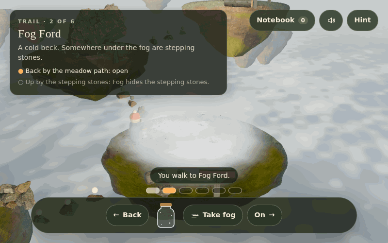
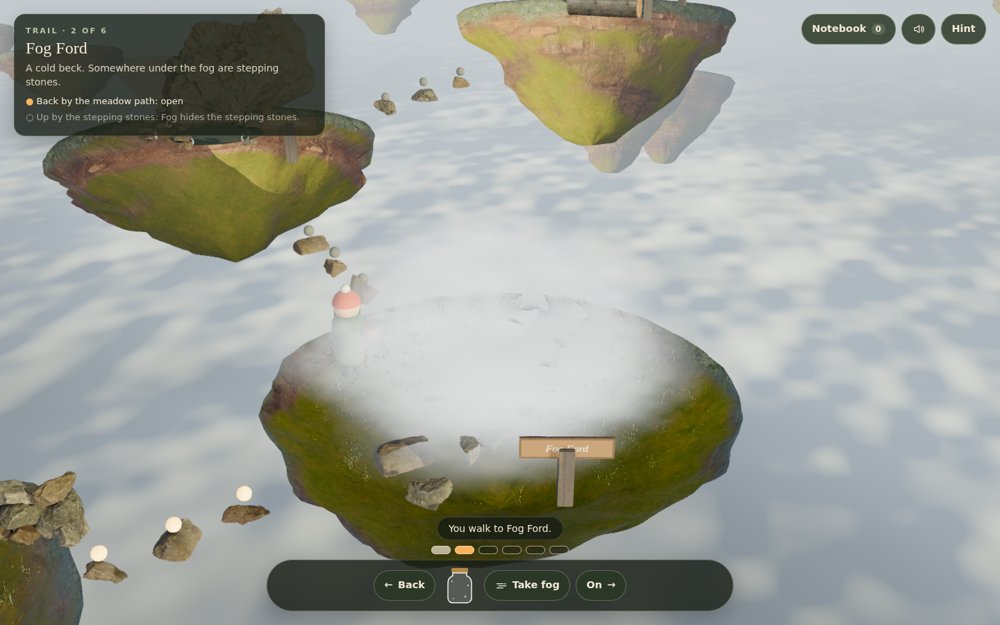
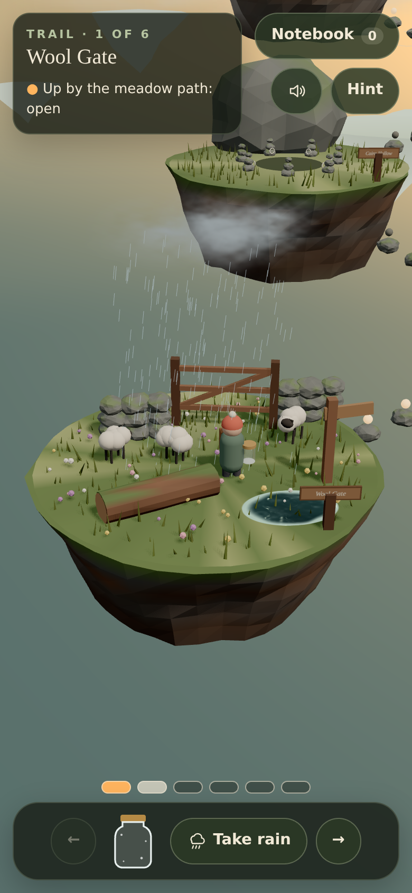

<div align="center">



<br />

[](https://05-borrowed-weather.williamking.workers.dev)


**Carry one glass jar up a misty mountain trail: every pocket of weather you borrow changes the place you took it from and the place you let it go.**



</div>

## How to play

Take weather and the place changes. Release it somewhere else and that place changes too. The jar holds one kind at a time, so order matters. Reach the Lantern Shelter above the clouds and wake its three instruments.

| Weather | What it does on the trail |
| --- | --- |
| Fog | Hides the ford's stepping stones and the tarn's ferry lane. Released in the marked hollow, it gathers into a cloud step. |
| Rain | Uncurls the terrace ferns into a stair, raises the water and fills the rain gauge. |
| Wind | Turns the vane that runs the basket lift, and fills the leaf ferry's sail. |

| Action | Keyboard | Mouse and touch |
| --- | --- | --- |
| Walk | <kbd>←</kbd> <kbd>→</kbd> or <kbd>A</kbd> <kbd>D</kbd> | Tap a diorama, a trail dot, or the ← → buttons |
| Take fog, rain or wind | <kbd>1</kbd> <kbd>2</kbd> <kbd>3</kbd> | **Take** buttons |
| Release what the jar holds | <kbd>R</kbd> | **Release** button |
| Hint | <kbd>H</kbd> | **Hint** |
| Field notebook | <kbd>N</kbd> | **Notebook** (sit on a log to read) |
| Mute or unmute | <kbd>M</kbd> | Speaker button |
| Close a panel | <kbd>Esc</kbd> | **Back to the trail** |

There is no timer and no fail state: every take can be undone by releasing it where it came from.

## What's inside

- **Six hand-built dioramas** climbing from a sheep gate to a lantern shelter above a cloud sea, built from scanned CC0 rock, turf, wood and grass under one real sky.
- **Two consequences per borrow:** the vane lift stops when its breeze is in your jar, so the route needs a real plan, not a straight walk.
- **Weather that looks like weather:** layered noise fog that veils the crossing, living water with foam and rain rings, a swirl that pours each pocket into and out of the jar.
- **A hint that never lies:** it runs a solver over the live puzzle and names the next take or release that matters, and what it will change.
- **A field notebook** that records each rule the first time you see it, and a **postcard** at the end that maps the route you actually took.
- **Sound that follows the weather:** rain patters where there is rain, fog muffles the world, and the music settles when a panel opens.
- **Plays anywhere:** desktop and phone layouts, mouse, touch and keyboard, visible focus, and `prefers-reduced-motion` respected throughout.

<table>
  <tr>
    <td width="72%"></td>
    <td width="28%"></td>
  </tr>
  <tr>
    <td align="center">Desktop, 1440 × 900</td>
    <td align="center">Phone, 390 × 844</td>
  </tr>
</table>

## Built with

three.js 0.186 (no React Three Fiber), React 19, strict TypeScript, Vite, GSAP, Tailwind CSS 4, Biome and Bun, with Playwright for the end-to-end walk. The world is lit by one CC0 sky and built from scanned CC0 rock, turf, wood and foliage, with the islands, fog, water and effects authored in code.

- **Weather routing solver.** The rules are pure TypeScript. A breadth-first search over all 37,430 reachable puzzle states proves in the tests that the trail can be finished from every one of them (no dead ends) and that every borrow can be undone. The same search powers the in-game hint.
- **One lighting model.** A CC0 HDRI is both the visible sky and the image-based light. Its sun is measured out of the image (direction, illuminance, colour), removed from the lighting copy so it is not counted twice, and handed to the key light. The post chain is GTAO, thresholded bloom, SMAA, then AgX once; exposure is the only brightness control.
- **Layered fog.** Each bank is a stack of horizontal sheets running an fbm noise shader, dense in the middle and feathered at the edges, with noisy billboards for side volume. Its level sinks and thins the bank as you bottle it.
- **Weather-aware sound mix.** A pure function maps where you stand to rain, wind, river and bird beds, and adds a low-pass filter while fog is present. Web Audio glides between mixes, and nothing loads until your first gesture.

## Run it locally

```sh
bun install
bun run dev      # http://127.0.0.1:4515/
bun run check    # strict tsc, Biome, bun test, production build into dist/
bun run e2e      # full trail, replay, notebook, touch layouts and loading/input regressions
```

The rules live in `src/game/` (tested in `tests/`), the three.js scene in `src/scene/`, sound in `src/audio/` and the React HUD in `src/ui/`. The browser suite needs Playwright Chromium (`bunx playwright install chromium`). The collection release runner uses installed Chrome on the real GPU; `REQUIRE_REAL_GPU=1` also asserts the RTX renderer. It covers two complete trails, ending/replay, discoveries, live reduced motion, held keys, slow loading and three touch layouts.

## Credits

Every shipped third-party file is recorded, with its source URL, author, licence, retrieval date, checksums and processing steps, in [`assets.manifest.json`](assets.manifest.json).

Visuals are all CC0 from [Poly Haven](https://polyhaven.com), resized and re-encoded as WebP (textures) or through gltf-transform with meshopt (models):

| Asset | Source | Author | Licence | Used for |
| --- | --- | --- | --- | --- |
| Table Mountain 1 (Pure Sky) HDRI | https://polyhaven.com/a/table_mountain_1_puresky | Greg Zaal, Jarod Guest | CC0 | Sky, image-based light, sun |
| Cliff Side | https://polyhaven.com/a/cliff_side | Poly Haven | CC0 | Island rock |
| Mossy Rock | https://polyhaven.com/a/mossy_rock | Poly Haven | CC0 | Moss, shelter masonry |
| Grass Ground | https://polyhaven.com/a/grass_ground | Poly Haven | CC0 | Turf, shelter roof |
| River Small Rocks | https://polyhaven.com/a/river_small_rocks | Poly Haven | CC0 | Beck and tarn beds |
| Weathered Planks | https://polyhaven.com/a/weathered_planks | Poly Haven | CC0 | Gate, posts, jetty, signs |
| Bark Brown 02 | https://polyhaven.com/a/bark_brown_02 | Poly Haven | CC0 | Logs, lift basket |
| Rock Moss Set 01 and 02 | https://polyhaven.com/a/rock_moss_set_01, https://polyhaven.com/a/rock_moss_set_02 | Poly Haven | CC0 | Walls, cairns, banks, stepping stones |
| Boulder 01 | https://polyhaven.com/a/boulder_01 | Poly Haven | CC0 | Hollow ledge, terrace cliff |
| Grass Medium 02, Fern 02 | https://polyhaven.com/a/grass_medium_02, https://polyhaven.com/a/fern_02 | Poly Haven (processed for ODD TIDE) | CC0 | Grass and ferns |

The islands, fog, water, clouds, jar, hiker, sheep, instruments and icons are generated in code. The post-processing chain, foliage wind and terrain shading are adapted from the ODD TIDE project in the same portfolio collection.

Audio is all CC0 (public domain). It was converted to mono OGG Vorbis, trimmed and crossfaded into loops, about 1.3 MB in total, in `public/audio/`:

| File(s) | Source | Author | Licence |
| --- | --- | --- | --- |
| `music.ogg` ("Contemplation") | https://opengameart.org/content/contemplation-0 | Joth | CC0 |
| `amb-rain.ogg` ("Amb rain loop 1") | https://opengameart.org/content/amb-rain-loop-1 | Kresiek The Furry | CC0 |
| `amb-birds.ogg`, `amb-river.ogg`, `amb-wind.ogg` ("Park ambiences") | https://opengameart.org/content/park-ambiences | Thimras | CC0 |
| `step-1..3.ogg` (footstep_grass), `take.ogg`, `release.ogg` (impactGlass), `restore.ogg` (impactBell) | https://kenney.nl/assets/impact-sounds | Kenney (kenney.nl) | CC0 |
| `book-open.ogg`, `book-close.ogg`, `page.ogg` (bookOpen, bookClose, bookFlip2) | https://kenney.nl/assets/rpg-audio | Kenney (kenney.nl) | CC0 |
| `click.ogg`, `hint.ogg`, `toggle.ogg` (click_002, question_002, toggle_001) | https://kenney.nl/assets/interface-sounds | Kenney (kenney.nl) | CC0 |
| `blocked.ogg`, `discover.ogg`, `finish.ogg` (jingles_PIZZI04, 10, 02) | https://kenney.nl/assets/music-jingles | Kenney (kenney.nl) | CC0 |

<p align="center"><sub>Part of William King's portfolio collection.</sub></p>
